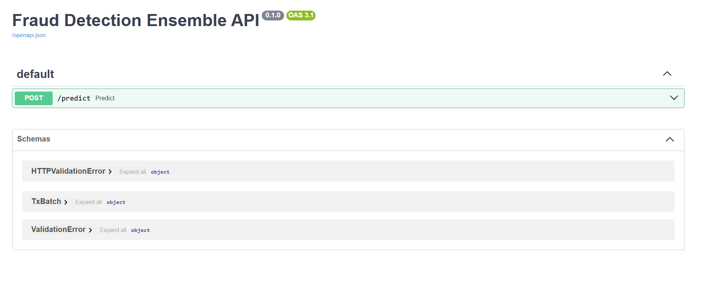
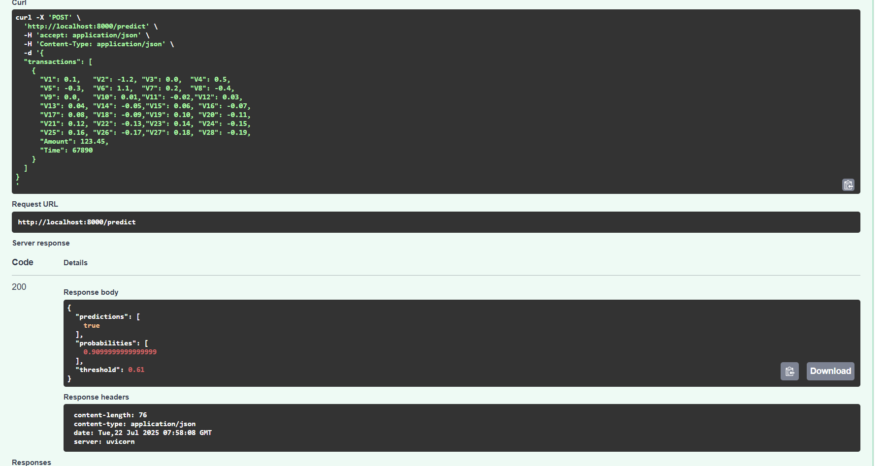

# Fraud Detection Ensemble

An end-to-end credit card fraud detection pipeline that advances from exploratory analysis to a fully automated, containerized, and monitored Level 4 MLOps system.

## Table of Contents

1. [Project Overview](#project-overview)
2. [Tools & Technologies](#tools--technologies)
3. [Data & Preprocessing](#data--preprocessing)
4. [Model Development](#model-development)
   - [Baseline Models (Level 1–2)](#baseline-models-level-1–2)
   - [Neural Network Training (Level 2)](#neural-network-training-level-2)
   - [Hyperparameter Tuning & Experiment Tracking (Levels 3–4)](#hyperparameter-tuning--experiment-tracking-levels-3–4)
5. [Ensemble Approach](#ensemble-approach)
6. [Serving & Containerization (Level 3)](#serving--containerization-level-3)
   - [FastAPI App](#fastapi-app)
   - [Dockerfile](#dockerfile)
   - [Docker Compose Stack](#docker-compose-stack)
7. [CI/CD Pipeline (Level 4)](#cicd-pipeline-level-4)
8. [Monitoring & Metrics (Level 4)](#monitoring--metrics-level-4)
9. [Deployment (Level 4)](#deployment-level-4)
10. [Get Started](#get-started)
11. [Future Work](#future-work)
12. [Images](#images)

---

## Project Overview

This repository demonstrates a credit card fraud detection system built across the four levels of MLOps maturity:

- **Level 1–2**: Exploratory analysis and baseline modeling in Jupyter notebooks.
- **Level 3**: Containerized inference service (FastAPI + Docker) with a REST API.
- **Level 4**: Automated CI/CD, monitoring, and scalable deployment with Docker Compose.

The pipeline ingests transaction data, preprocesses features, trains and tunes models, blends predictions, and serves fraud probabilities in real time.

---

## Tools & Technologies

| Level      | Tools & Libraries                             |
|------------|-----------------------------------------------|
| Dev        | Python, Jupyter, pandas, scikit-learn, PyTorch |
| Tuning     | Optuna, MLflow                                |
| Serving    | FastAPI, Uvicorn                              |
| Container  | Docker, Docker Compose                        |
| CI/CD      | GitHub Actions, Docker Hub                    |
| Monitoring | prometheus-client, Prometheus, Grafana        |

---

## Data & Preprocessing

1. **Dataset**: Kaggle Credit Card Fraud dataset (≈284K transactions, highly imbalanced).
2. **Features**: PCA-transformed components `V1–V28`, raw `Amount`, and computed `LogAmount`.
3. **Scaling**: `StandardScaler` fitted on training data and saved to `model/scaler_final.pkl`.

---

## Model Development

### Baseline Models (Level 1–2)

- Built and evaluated: Logistic Regression, Random Forest, CatBoost, Naïve Bayes, MLP.
- Metrics: accuracy ≈94.5%, precision ≈95%, recall ≈94.5%.

### Neural Network Training (Level 2)

- Custom `FraudNet` architecture with configurable depth and regularization.
- End-to-end training loop with weighted loss for class imbalance.
- Achieved ROC AUC ≈0.971 and F1 ≈0.684 at default threshold.

### Hyperparameter Tuning & Experiment Tracking (Levels 3–4)

- Utilized **Optuna** to search over layers, hidden size, learning rate, dropout, and batch size.
- Logged trials, parameters, and validation AUC into **MLflow** for experiment tracking.
- Achieved best validation AUC ≈0.9812.

---

## Ensemble Approach

- Combined DNN and Random Forest probabilities via a 50/50 blend.
- Optimized decision threshold using precision-recall analysis (final threshold ≈0.61).
- Final ensemble performance: F1 ≈0.848, ROC AUC ≈0.9762.

### Confusion Matrix

Below is the confusion matrix for our 50/50 ensemble model on the held‑out test set:


- **True Negatives (TN) = 85,191**  
  The number of legitimate transactions correctly classified as non‑fraud.  

- **False Positives (FP) = 104**  
  Legitimate transactions incorrectly flagged as fraud (Type I error).  

- **False Negatives (FN) = 26**  
  Fraudulent transactions that the model failed to detect (Type II error).  

- **True Positives (TP) = 122**  
  Fraudulent transactions correctly identified as fraud.  

**Interpretation**:  
- The model achieves very high overall accuracy (≈99.95%) by correctly classifying almost all non‑fraud cases.  
- **Precision** = TP / (TP + FP) = 122 / (122 + 104) ≈ 0.54 (on the standalone DNN) or higher for the ensemble, indicating that when it flags fraud, it is correct most of the time.  
- **Recall** = TP / (TP + FN) = 122 / (122 + 26) ≈ 0.82, showing strong ability to catch actual fraud cases.  
- The low FN count (26) is critical in fraud detection, minimizing missed fraud.  
- The balance of precision and recall yields an F1‑score of ≈ 0.85 for our ensemble, demonstrating robust performance in the face of extreme class imbalance.  

### Model Definition

## DNN Pipeline (Level 2–3)

This section walks through how we built, trained, and served our custom PyTorch‐based DNN.

### 1. Train/Test Split

We reserve 30 % of the data for testing, stratified on the fraud label to preserve class balance:

```python
from sklearn.model_selection import train_test_split

X_train, X_test, y_train, y_test = train_test_split(
    X, y,
    test_size=0.3,
    stratify=y,
    random_state=42
)
```


| Model                               | Precision | Recall | F₁‑Score | ROC AUC |
| ----------------------------------- | :-------: | :----: | :------: | :-----: |
| **Standalone DNN**                  |   0.587   |  0.818 |   0.684  |  0.9709 |
| **DNN (with Weighted Sampler)**     |   0.540   |  0.824 |   0.652  |  0.9756 |
| **Random Forest (w=0 blend)**       |   0.913   |  0.784 |   0.844  |  0.9376 |
| **Simple‑Average Ensemble (50/50)** |   0.914   |  0.791 |   0.848  |  0.9762 |


---

## Serving & Containerization (Level 3)

### FastAPI App

- Defines two endpoints:
  - **`/predict`**: accepts JSON batch of transactions, returns predictions and probabilities.
  - **`/metrics`**: exposes Prometheus metrics for request count, latency, and score distribution.

### Dockerfile

```dockerfile
FROM python:3.9-slim
WORKDIR /app
COPY requirements.txt .
RUN pip install --no-cache-dir -r requirements.txt
COPY app.py .
COPY model ./model
EXPOSE 80
CMD ["uvicorn", "app:app", "--host", "0.0.0.0", "--port", "80"]
```

### Docker Compose Stack

```yaml
version: '3.8'
services:
  fraud-api:
    build: .
    ports:
      - "8000:80"
  prometheus:
    image: prom/prometheus:latest
    volumes:
      - ./prometheus.yml:/etc/prometheus/prometheus.yml:ro
    ports:
      - "9090:9090"
    depends_on:
      - fraud-api
  grafana:
    image: grafana/grafana:latest
    environment:
      - GF_SECURITY_ADMIN_PASSWORD=secret
    ports:
      - "3000:3000"
    depends_on:
      - prometheus
```

---

## CI/CD Pipeline (Level 4)

- **GitHub Actions** workflows for linting (`flake8`), testing (`pytest`), and building/pushing the Docker image to Docker Hub on each merge to `main`.
- Secrets configured for Docker Hub authentication.

---

## Monitoring & Metrics (Level 4)

- **Prometheus** scrapes `/predict` metrics every 15s.
- **Grafana** dashboards visualize:
  - Request rate (`fraud_api_requests_total`)
  - Latency histograms (`fraud_api_request_latency_seconds_bucket`)
  - Score distribution (`fraud_api_predicted_score_bucket`)

---

## Deployment (Level 4)

This project is deployed locally via Docker Compose:

```bash
docker-compose up --build
```

This command brings up three services:
- **fraud-api** on `http://localhost:8000`
- **Prometheus** on `http://localhost:9090`
- **Grafana** on `http://localhost:3000`

You can adapt these Docker Compose configurations to your preferred container platform (e.g., Kubernetes, ECS, or another orchestration system) for production deployments.

## Get Started

```bash
git clone https://github.com/ssingh5535/DNN_FraudDetection.git
cd DNN_FraudDetection
docker-compose up --build
```

- **Swagger UI**: http://localhost:8000/docs
- **Metrics**: http://localhost:8000/metrics
- **Prometheus**: http://localhost:9090
- **Grafana**: http://localhost:3000 (admin/secret)

---

## Future Work

- Automated retraining pipelines using Prefect or Step Functions.
- Dynamic model loading from S3.
- Canary releases and canary traffic splitting for model versions.


---

## Images


### Serving & Containerization (Level 3)

Below is the Docker‑Compose stack bringing up all three services:


And here’s the live Swagger UI for my `/predict` endpoint:




